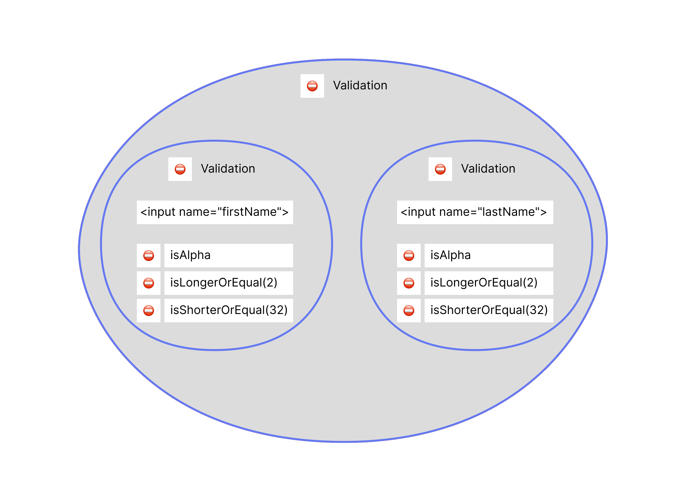
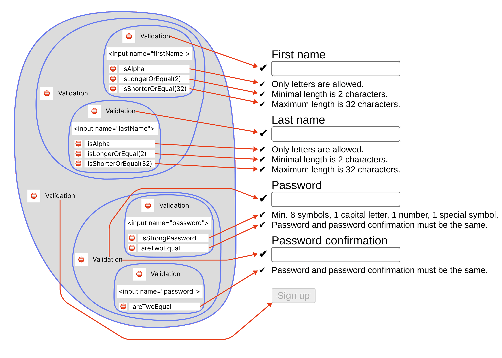

import Playground from '../../../components/Playground.jsx';
import groupingValidationsHTML from '../../../../public/playground/concept/grouping-validations/grouping-validations.html?raw';
import groupingValidationsCSS from '../../../../public/playground/concept/grouping-validations/grouping-validations.css?raw';
import groupingValidationsJS from '../../../../public/playground/concept/grouping-validations/grouping-validations.js?raw';

Grouping validations are created with static methods: 
- [`Validation.group()`](/api/validation/static-methods/group) 
- [`Validation.glue()`](/api/validation/static-methods/glue) 
- [`Validation.profile()`](/api/validation/static-methods/profile)

A grouping `Validation` object contains several predicate groups which can be associated with different validatable objects as well as with the same one. Its validity state depends on execution results of all predicate functions in the contained groupes.

```js 
Validation.group( Validation(firstName), Validation(lastName) )
    .constraint(isAlpha)
    .constraint(isLongerOrEqual(2)) 
    .constraint(isShorterOrEqual(32))

// firstName, lastName are HTMLInputElement (validatable objects)
// isAlpha, isLongerOrEqual(2), isShorterOrEqual(32) are predicate functions
```



The [`Validation().constraint()`](/api/validation/instance-methods/constraint) method invoked on a grouping `Validation` adds a predicate function to each predicate group it contains.

Consider this code snippet. 

```js 
const signupValidation = Validation.group(

    Validation.group( Validation(firstName), Validation(lastName) )
        .constraint(isAlpha)
        .constraint(isLongerOrEqual(2))
        .constraint(isShorterOrEqual(32)),

    Validation.glue(

        Validation(password)
            .constraint(isStrongPassword),

        Validation(pwdConfirm),

    ).constraint(areTwoEqual),
);

// firstName, lastName, password, pwdConfirm are HTMLInputElement (validatable objects)
// isAlpha, isLongerOrEqual(2), isShorterOrEqual(32), isStrongPassword, 
//  areTwoEqual are predicate functions
```

Resulting `signupValidation` will contain 4 predicate groups which can be accessed through the [`Validation().constraints`](/api/validation/instance-properties/constraints) property as `signupValidation.constraints`:
    - `firstName`:

        - `isAlpha`

        - `isLongerOrEqual(2)`

        - `isShorterOrEqual(32)`

    - `lastName`:

        - `isAlpha`

        - `isLongerOrEqual(2)`

        - `isShorterOrEqual(32)`

    - `password`:

        - `isStrongPassword`

        - `areTwoEqual`

    - `pwdConfirm`:

        - `areTwoEqual`


The `Validation` objects that were grouped can be accessed through the [`Validation().validations`](/api/validation/instance-properties/validations) property as `signupValidation.validations`.

We can connect UI effects to state changes of the grouping `Validation`, its grouped validations, and execution of predicate functions.

```js /valid(?=[\W])/ "invalid" "changed" /(?<=[.])constraints/ /(?<=[.])validations/
// add a UI effect to the grouping validation
signupValidation.changed(toggleAccess(submitBtn));

// add a UI effect to the grouped (nested) validations
const [ firstAndLastNameV, pwdV ] = signupValidation.validations;

[ ...firstAndLastNameV.validations, pwdV, pwdV ].forEach(
    (validation, idx) => validation
        .valid(showStatus(fields[idx]))
        .invalid(showStatus(fields[idx]))
);

// add a UI effect to execution of the predicate functions
[...signupValidation.constraints].forEach(
    ([, validator], idx) => validator
        .valid(showStatus(constraints[idx]))
        .invalid(showStatus(constraints[idx]))
);
```

Now, if we add the grouping `Validation` as an [event handler](/api/validation/callable-object/event-handler) it will be running the predicate group associated with the input element passed as the [`target`](https://developer.mozilla.org/en-US/docs/Web/API/Event/target) property of the [`Event`](https://developer.mozilla.org/en-US/docs/Web/API/Event) object.



Try it in action in the playground below.

<Playground client:visible  
    params={{
        console: 'closed',
        html: groupingValidationsHTML,
        css: groupingValidationsCSS,
        js: groupingValidationsJS,
    }}
    height="500px"
    width="100%"
/>