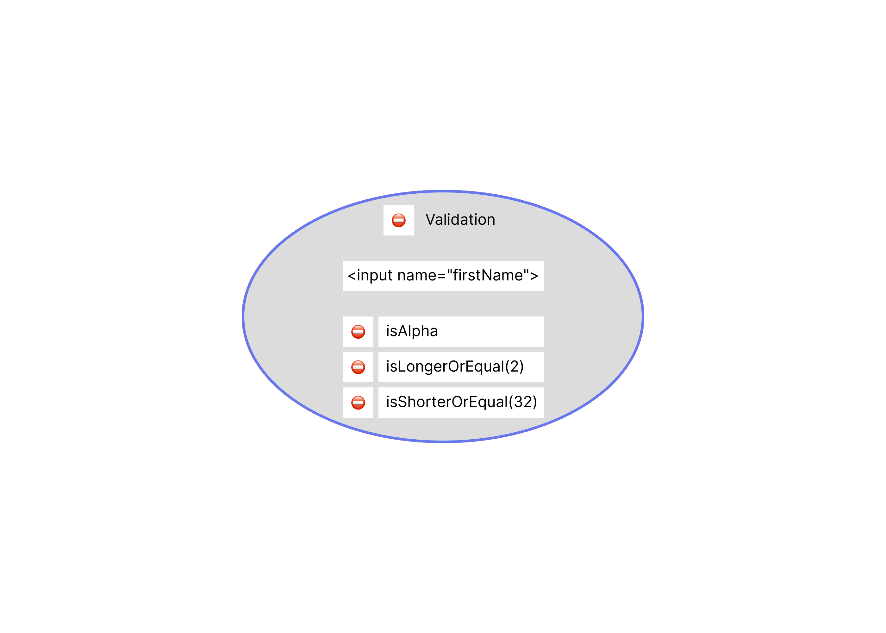
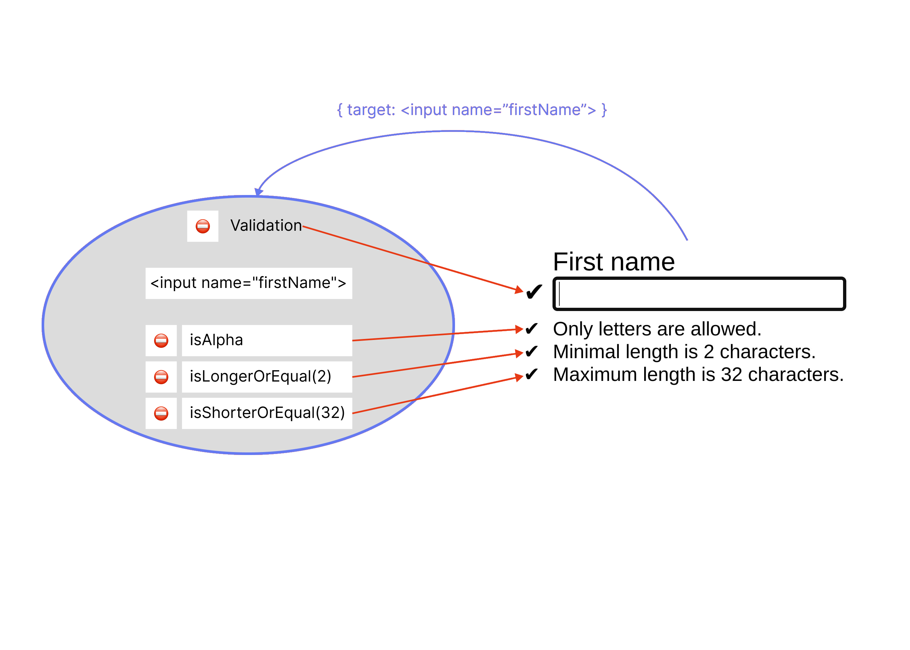

import Playground from '../../../components/Playground.jsx';
import singleValidationHTML from '../../../../public/playground/concept/single-validation/single-validation.html?raw';
import singleValidationCSS from '../../../../public/playground/concept/single-validation/single-validation.css?raw';
import singleValidationJS from '../../../../public/playground/concept/single-validation/single-validation.js?raw';

A single `Validation` object contains only one predicate group associated with the bound validatable object. Its validity state depends on results of executing the predicates.

```js 
Validation(firstName)
    .constraint(isAlpha)
    .constraint(isLongerOrEqual(2)) 
    .constraint(isShorterOrEqual(32))

// firstName is an HTMLInputElement (validatable object)
// isAlpha, isLongerOrEqual(2), isShorterOrEqual(32) are predicate functions
```



We can connect UI effects to changes of the validity state of a `Validation` object and changes of execution results of its predicates by adding [`state callbacks`](/concept/state-callbacks).

```js "valid" "invalid"
Validation(firstName)
    .constraint(
        Predicate(isAlpha)
            .valid(showStatus(firstNameConstraints[0]))
            .invalid(showStatus(firstNameConstraints[0]))
    )
    .constraint(
        Predicate(isLongerOrEqual(2))
            .valid(showStatus(firstNameConstraints[1]))
            .invalid(showStatus(firstNameConstraints[1]))
    )
    .constraint(
        Predicate(isShorterOrEqual(32))
            .valid(showStatus(firstNameConstraints[2]))
            .invalid(showStatus(firstNameConstraints[2]))
    )
    .valid(showStatus(firstName.parentElement))
    .invalid(showStatus(firstName.parentElement))

// Predicate() is a wrapper for adding state callbacks to predicate functions
```

It is also possible to access added constraints through the [`Validation().constraints`](/api/validation/instance-properties/constraints) property in order to connect UI effects and achieve slightly more compact code:

```js /valid(?=[\W])/ "invalid" "constraints"
const validation = Validation(firstName)
    .constraint(isAlpha)
    .constraint(isLongerOrEqual(2))
    .constraint(isShorterOrEqual(32))
    .valid(showStatus(firstName.parentElement))
    .invalid(showStatus(firstName.parentElement));

[...validation.constraints].forEach(
    ([,validator], idx) => validator
        .valid(showStatus(firstNameConstraints[idx]))
        .invalid(showStatus(firstNameConstraints[idx]))
);
```

Now, to run the predicate group, we need to add the `Validation` object as an [event handler](/api/validation/callable-object/event-handler) or invoke the [`Validation().validate()`](/api/validation/instance-methods/validate) method explicitly.



Try it in action in the playground below.

<Playground client:visible  
    params={{
        console: 'closed',
        html: singleValidationHTML,
        css: singleValidationCSS,
        js: singleValidationJS,
    }}
    height="500px"
    width="100%"
/>